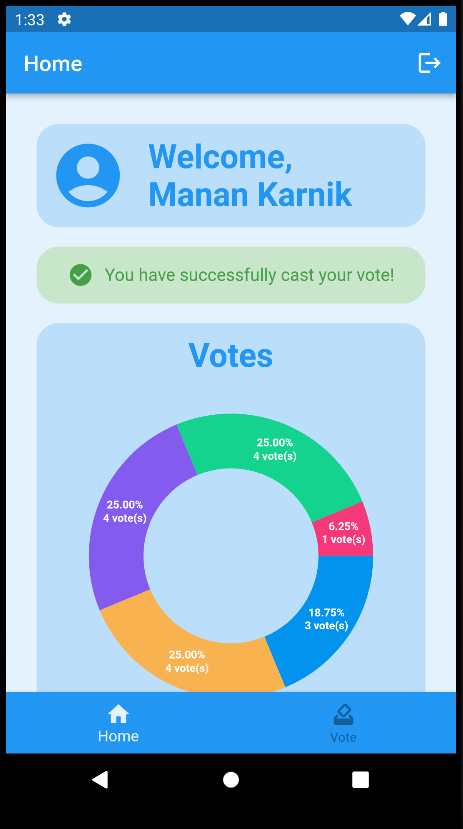

# E Voting App

Simple voting application written in flutterfire with OTP validation.

## Quick Start

### Clone Repo

```sh
git clone https://github.com/manankarnik/e-voting-app.git
```

### Run Project

```sh
cd e-voting-app && flutter run
```

## Screenshots

### Register


### Login


### OTP Validation


### Home




### Vote


